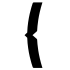

# BnF-locator
*Localisation de photographies de Gallica-BnF*

1. 🔍 Rechercher sur un mot clé     
2. 🖼️ choisissez une image dans la liste     
3. 🌍 localiser sur la carte    
4. 📥 exporter le résultat en GeoJSON 

Le projet utilise l'[API SRU](https://github.com/hackathonBnF/hackathon2016/wiki/API-SRU) de recherche avec le moteur de recherche de Gallica, présentée lors du [Hackathon BnF 2016](https://github.com/hackathonBnF/hackathon2016).
